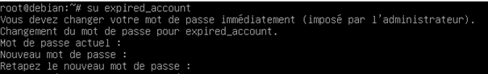
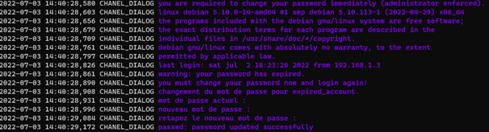

# change_password_expired_account

## Prérequis

Disposer de python3.9>= sur ça machine.

## Description

Ce script a pour objectif de permettre de changer en masse des mots de passe expirés.

## Installation

````bash

python -m pip install requirement.txt
````

## Différence entre les différents sous-modules

Le script est décomposé en deux modules : mode interactive, mode non-interactive.

Le module interactif est à préférer lorsque l'outil est utilisé directement en ligne de commande pour des raisons de confidentialité.

````PowerShell
PS C:\Users\User\Bureau\change_expired_password> history   
                                                                       
  Id     Duration CommandLine
  --     -------- -----------
   1       23.680 python .\change_pass.py  interractive --input_list 192.168.1.100,192.168.1.101,192.168.1.103
   2       21.351 python .\change_pass.py  noneInterractive expired_account current_password new_password 192.168.1.100,192.168.1.101,192.168.1.103
````

Le module non-interractive est à préférer lorsque l'outil est intégré dans un script.

## Usage

Voir :

* change_pass.py -h
* change_pass.py interractive -h
* change_pass.py noneInterractive -h

## Configuration

La configuration de l'outil se fait dans le fichier config.ini, la configuration de base est :

````ini

[log_level]
; Possible value debug, chanel_dialog, info
level = debug

[patterns]
; String must be separate by comma exemple pattern1,pattern2,etc ...
; Case insensibility 
attempt_pattern_prompt1 = actuel,current

; String must be separate by comma exemple pattern1,pattern2,etc ...
; Prompt Tape new password
attempt_pattern_prompt2 = nouveau,new

; String must be separate by comma exemple pattern1,pattern2,etc ...
; Prompt Retape new password
attempt_pattern_prompt3 = retapez,retape

; String must be separate by comma exemple pattern1,pattern2,etc ...
;Prompt when password sucefully change
attempt_pattern_prompt4 = successfully


````

Les patterns sont des mots attendus dans le prompt de changement de mot de passe exemple :



Pour rechercher de nouveaux mot, configurer le niveau de debug à chanel_dialog puis chercher dans les logs affichés en violet.


